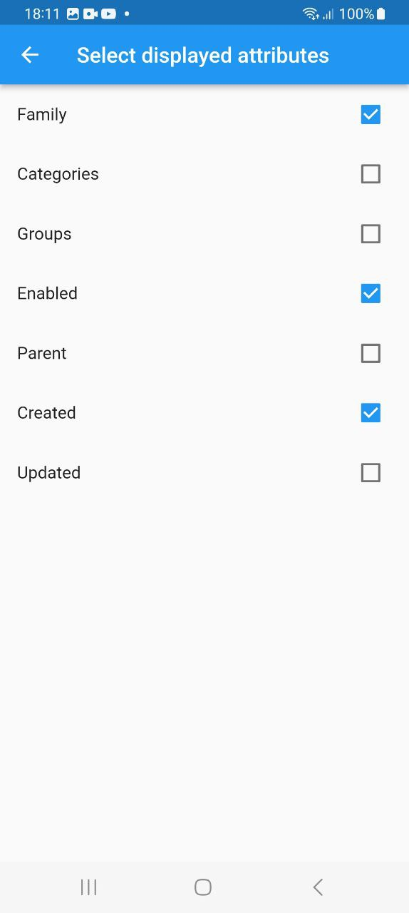
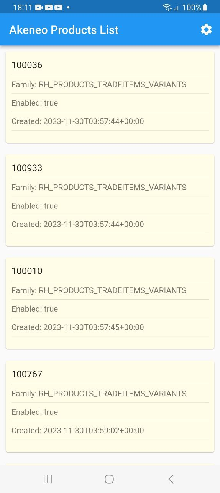
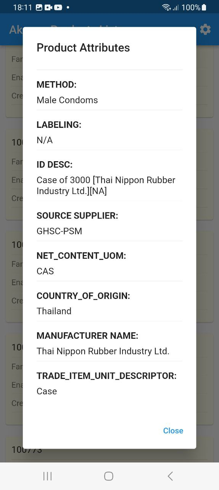

# Akeneo API Client Example Application

Welcome to the Akeneo API Client Example Application. This Flutter application demonstrates how to effectively utilize the Akeneo API Client library to retrieve and showcase a list of products from the Akeneo PIM API.

## Screenshots

Take a look at the application in action:

<p align="center">


&nbsp;&nbsp;&nbsp;&nbsp;

&nbsp;&nbsp;&nbsp;&nbsp;


</p>


## Getting Started

To get started and run the example application on your local machine, just follow these simple steps:

### 1. Clone the Repository

Clone this repository to your local machine using Git:

```bash
git clone https://github.com/ETdvlpr/akeneo_api_client.git
cd akeneo_api_client/example
```

### 2. Install Dependencies

Use Flutter's package manager to install the required dependencies:

```bash
flutter pub get
```

### 3. Run the Application

Execute the following command to run the application on a connected device or emulator:

```bash
flutter run
```

Feel free to explore the code, adapt it to your needs, and learn how to effectively interact with the Akeneo API using the provided client library.

Happy coding! If you encounter any issues or have questions, don't hesitate to reach out.
